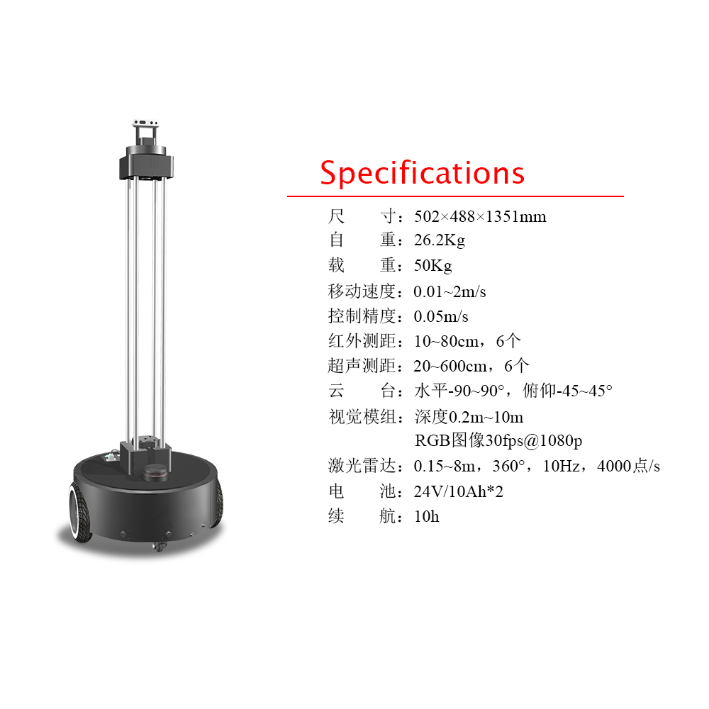

# XBot-U ROS 驱动程序包集

## 简介

XBot-U机器人是一款面向高校与科研院所研发的双轮差分式移动机器人。

机器人配备了当前移动机器人市场上主流的多种传感器与精准的控制器，能实现机器人的自主定位、导航、规划以及多种交互功能。

作为XBot-U机器人的研发与生产厂商，重德智能是一家由中国科学院软件研究所机器人组孵化的智能机器人技术企业。重德智能的使命在于为更多的机器人研究学习与爱好者提供开源好用的ROS机器人软硬件平台。

重德智能为XBot-U机器人开发了稳定的运动控制器与传感器数据融合及运动解算，并将所有的软件算法融合进入ROS的软件包中。除此之外，XBot-U还针对性的适配和对接了目前ROS社区当中开源的大部分移动机器人算法，真正做到**会ROS就会使用我们的机器人**。

更多XBot-U机器人的相关信息与介绍，请访问XBot-U的ROS机器人社区页面 http://robots.ros.org/xbot/。

## ROS软件包
该软件包集包含7个ROS软件子包。

| ROS软件包              | 主要功能                                 |
| ---------------------- | ---------------------------------------- |
| xbot_bringup           | 驱动程序启动入口，包含多个launch文件     |
| xbot_driver            | 底层通讯驱动，收发数据                   |
| xbot_node              | ROS数据封装与分发，运动解算              |
| xbot_msgs              | 软件包集所用到的所有ROS消息类型          |
| xbot_safety_controller | 机器人安全控制程序                       |
| xbot_description       | ROS建模与urdf描述文件                    |
| xbot_tools             | 用于调试、开发以及运行过程的一些工具软件 |

## 使用方法
以下介绍几种常用的机器人ROS程序启动方法：
### xbot.launch
>roslaunch xbot_bringup xbot.launch

仅驱动机器人。
### xbot-u.launch

> roslaunch xbot_bringup xbot-u.launch

也是机器人的开机启动程序，启动了以下程序：

1. xbot.launch
2. rplidar.launch
3. realsense.launch
4. pub_camera_image
5. face_recog.py
6. talker.launch
7. wev_video_server
8. rosbridge_server.launch

更多使用方法，可单独启动以上单个launch或者节点文件，或者前往参考xbot的roswiki软件说明。

## 联系我们

**XBot-U机器人网站**：<https://www.droid.ac.cn/xbot_u.html>

**商务合作**：bd@droid.ac.cn

**技术咨询**：wangpeng@droid.ac.cn或添加微信:18046501051（注明XBot-U咨询）

