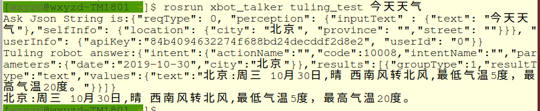

## 图灵对话接口测试
启动脚本tuling_test：
```
rosrun xbot_talker tuling_test [问题]
```

后面跟的是想要问的问题。运行后可以得到图灵机器人的回答结果。比如



## 唤醒、百度在线语音识别+图灵对话测试
修改asr_module.launch里的参数：
- enable_online：true
- enable_offline：false

之后启动：
```
roslaunch xbot_talker xbot_talker.launch
```

即可开启整体流程对话测试。
